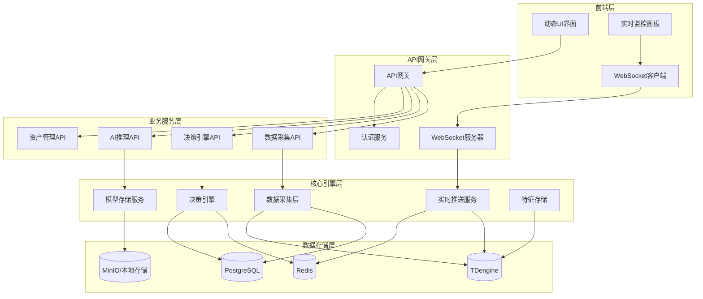
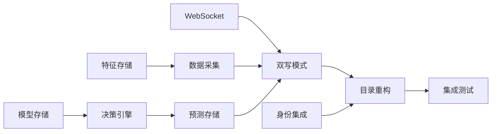

# 设计文档 - 工业AI数据平台升级 V2

## 概述

本设计文档定义了工业AI数据平台第二阶段升级的技术架构和实现方案。基于V1升级的基础，本阶段专注于实现完整的AI闭环系统，包括决策引擎、模型文件存储、实时WebSocket推送、预测结果时序存储等核心功能，以补齐与原始设计规划的偏差。

## 架构设计

### 整体架构



### 目录结构规划

```
Industrial-AI-Data-Platform/
├── platform/                      # 平台核心层
│   ├── api/                       # 统一API网关
│   ├── metadata/                  # 元数据管理
│   ├── timeseries/                # 时序数据服务
│   ├── ingestion/                 # 数据采集层 [新增]
│   │   ├── adapters/              # 协议适配器
│   │   │   ├── mqtt_adapter.py
│   │   │   ├── http_adapter.py
│   │   │   └── modbus_adapter.py
│   │   ├── validator.py           # 数据验证
│   │   └── dual_writer.py         # 双写服务
│   └── realtime/                  # 实时推送 [新增]
│       ├── websocket_server.py
│       ├── subscription_manager.py
│       └── push_service.py
│
├── ai_engine/                     # AI引擎层
│   ├── feature_hub/               # 特征工厂
│   ├── model_registry/            # 模型注册
│   ├── inference/                 # 推理服务
│   ├── model_storage/             # 模型文件存储 [新增]
│   │   ├── storage_backend.py
│   │   ├── minio_storage.py
│   │   └── local_storage.py
│   └── decision_engine/           # 决策引擎 [新增]
│       ├── rule_parser.py
│       ├── rule_runtime.py
│       ├── action_executor.py
│       └── audit_logger.py
│
└── frontend/                      # 前端层
    └── src/
        └── components/
            └── realtime/          # 实时监控组件 [新增]
                ├── WebSocketClient.js
                ├── RealtimeChart.vue
                └── AlertNotification.vue
```

## 组件设计

### 1. 决策引擎 (Decision Engine)

决策引擎负责将AI预测结果转化为告警和动作，实现预测性维护的完整闭环。

#### 1.1 规则DSL设计

```json
{
    "rule_id": "rule_001",
    "name": "电机过热预警",
    "description": "当预测温度超过阈值时触发告警",
    "enabled": true,
    "priority": 1,
    "conditions": {
        "type": "AND",
        "rules": [
            {
                "field": "predicted_value",
                "operator": "gt",
                "value": 80
            },
            {
                "field": "confidence",
                "operator": "gte",
                "value": 0.8
            }
        ]
    },
    "actions": [
        {
            "type": "alert",
            "level": "warning",
            "message": "预测温度超过80°C，置信度{confidence}"
        },
        {
            "type": "notification",
            "channels": ["email", "sms"],
            "recipients": ["maintenance@company.com"]
        }
    ],
    "cooldown_seconds": 300
}
```

#### 1.2 核心类设计

```python
# ai_engine/decision_engine/rule_parser.py

from dataclasses import dataclass
from typing import List, Dict, Any, Optional
from enum import Enum

class ConditionOperator(str, Enum):
    EQ = "eq"      # 等于
    NE = "ne"      # 不等于
    GT = "gt"      # 大于
    GTE = "gte"    # 大于等于
    LT = "lt"      # 小于
    LTE = "lte"    # 小于等于
    IN = "in"      # 在列表中
    BETWEEN = "between"  # 在范围内

class LogicalOperator(str, Enum):
    AND = "AND"
    OR = "OR"

@dataclass
class Condition:
    field: str
    operator: ConditionOperator
    value: Any

@dataclass
class ConditionGroup:
    type: LogicalOperator
    rules: List[Condition]

@dataclass
class Action:
    type: str  # alert, notification, webhook, workorder
    config: Dict[str, Any]

@dataclass
class Rule:
    rule_id: str
    name: str
    enabled: bool
    priority: int
    conditions: ConditionGroup
    actions: List[Action]
    cooldown_seconds: int = 0
    description: Optional[str] = None

class RuleParser:
    """规则DSL解析器"""
    
    @staticmethod
    def parse(rule_dict: Dict[str, Any]) -> Rule:
        """解析规则DSL为Rule对象"""
        pass
    
    @staticmethod
    def validate(rule_dict: Dict[str, Any]) -> Tuple[bool, List[str]]:
        """验证规则DSL格式"""
        pass
    
    @staticmethod
    def serialize(rule: Rule) -> Dict[str, Any]:
        """序列化Rule对象为DSL"""
        pass
```

```python
# ai_engine/decision_engine/rule_runtime.py

class RuleRuntime:
    """规则运行时引擎"""
    
    def __init__(self):
        self._rules: Dict[str, Rule] = {}
        self._cooldowns: Dict[str, datetime] = {}
        self._audit_logger = AuditLogger()
    
    async def load_rules(self) -> int:
        """从数据库加载所有启用的规则"""
        pass
    
    async def evaluate(self, prediction: Dict[str, Any]) -> List[Dict]:
        """
        评估预测结果，返回触发的动作列表
        
        Args:
            prediction: 预测结果，包含model_id, asset_id, predicted_value, confidence等
        
        Returns:
            List[Dict]: 触发的动作列表
        """
        triggered_actions = []
        
        # 按优先级排序规则
        sorted_rules = sorted(
            [r for r in self._rules.values() if r.enabled],
            key=lambda r: r.priority
        )
        
        for rule in sorted_rules:
            # 检查冷却时间
            if self._is_in_cooldown(rule.rule_id):
                continue
            
            # 评估条件
            if self._evaluate_conditions(rule.conditions, prediction):
                # 记录审计日志
                await self._audit_logger.log_trigger(rule, prediction)
                
                # 收集动作
                for action in rule.actions:
                    triggered_actions.append({
                        "rule_id": rule.rule_id,
                        "action": action,
                        "prediction": prediction
                    })
                
                # 设置冷却时间
                self._set_cooldown(rule.rule_id, rule.cooldown_seconds)
        
        return triggered_actions
    
    def _evaluate_conditions(self, conditions: ConditionGroup, data: Dict) -> bool:
        """评估条件组"""
        pass
    
    def _is_in_cooldown(self, rule_id: str) -> bool:
        """检查规则是否在冷却期"""
        pass
    
    def _set_cooldown(self, rule_id: str, seconds: int):
        """设置规则冷却时间"""
        pass
```

```python
# ai_engine/decision_engine/action_executor.py

class ActionExecutor:
    """动作执行器"""
    
    def __init__(self):
        self._handlers = {
            "alert": self._handle_alert,
            "notification": self._handle_notification,
            "webhook": self._handle_webhook,
            "workorder": self._handle_workorder
        }
    
    async def execute(self, action_data: Dict[str, Any]):
        """执行动作"""
        action_type = action_data["action"].type
        handler = self._handlers.get(action_type)
        
        if handler:
            await handler(action_data)
        else:
            logger.warning(f"未知的动作类型: {action_type}")
    
    async def _handle_alert(self, action_data: Dict):
        """处理告警动作"""
        pass
    
    async def _handle_notification(self, action_data: Dict):
        """处理通知动作"""
        pass
    
    async def _handle_webhook(self, action_data: Dict):
        """处理Webhook动作"""
        pass
    
    async def _handle_workorder(self, action_data: Dict):
        """处理工单动作"""
        pass
```

### 2. 模型文件存储服务 (Model Storage Service)

#### 2.1 存储后端抽象

```python
# ai_engine/model_storage/storage_backend.py

from abc import ABC, abstractmethod
from typing import BinaryIO, Optional
from dataclasses import dataclass

@dataclass
class StorageResult:
    success: bool
    file_path: str
    checksum: str
    size_bytes: int
    error: Optional[str] = None

class StorageBackend(ABC):
    """存储后端抽象基类"""
    
    SUPPORTED_FORMATS = [".pkl", ".onnx", ".h5", ".joblib"]
    
    @abstractmethod
    async def upload(self, file: BinaryIO, filename: str) -> StorageResult:
        """上传文件"""
        pass
    
    @abstractmethod
    async def download(self, file_path: str) -> BinaryIO:
        """下载文件"""
        pass
    
    @abstractmethod
    async def delete(self, file_path: str) -> bool:
        """删除文件"""
        pass
    
    @abstractmethod
    async def exists(self, file_path: str) -> bool:
        """检查文件是否存在"""
        pass
    
    def validate_format(self, filename: str) -> bool:
        """验证文件格式"""
        return any(filename.endswith(fmt) for fmt in self.SUPPORTED_FORMATS)
    
    @staticmethod
    def calculate_checksum(file: BinaryIO) -> str:
        """计算文件校验和"""
        import hashlib
        sha256 = hashlib.sha256()
        for chunk in iter(lambda: file.read(8192), b""):
            sha256.update(chunk)
        file.seek(0)
        return sha256.hexdigest()
```

#### 2.2 MinIO存储实现

```python
# ai_engine/model_storage/minio_storage.py

from minio import Minio
from io import BytesIO

class MinIOStorage(StorageBackend):
    """MinIO对象存储实现"""
    
    def __init__(self, endpoint: str, access_key: str, secret_key: str, bucket: str):
        self.client = Minio(
            endpoint,
            access_key=access_key,
            secret_key=secret_key,
            secure=False
        )
        self.bucket = bucket
        self._ensure_bucket()
    
    def _ensure_bucket(self):
        """确保存储桶存在"""
        if not self.client.bucket_exists(self.bucket):
            self.client.make_bucket(self.bucket)
    
    async def upload(self, file: BinaryIO, filename: str) -> StorageResult:
        """上传文件到MinIO"""
        if not self.validate_format(filename):
            return StorageResult(
                success=False,
                file_path="",
                checksum="",
                size_bytes=0,
                error=f"不支持的文件格式: {filename}"
            )
        
        try:
            # 计算校验和
            checksum = self.calculate_checksum(file)
            
            # 生成存储路径
            file_path = f"models/{checksum[:8]}/{filename}"
            
            # 获取文件大小
            file.seek(0, 2)
            size = file.tell()
            file.seek(0)
            
            # 上传文件
            self.client.put_object(
                self.bucket,
                file_path,
                file,
                size
            )
            
            return StorageResult(
                success=True,
                file_path=file_path,
                checksum=checksum,
                size_bytes=size
            )
        except Exception as e:
            return StorageResult(
                success=False,
                file_path="",
                checksum="",
                size_bytes=0,
                error=str(e)
            )
    
    async def download(self, file_path: str) -> BinaryIO:
        """从MinIO下载文件"""
        response = self.client.get_object(self.bucket, file_path)
        return BytesIO(response.read())
    
    async def delete(self, file_path: str) -> bool:
        """从MinIO删除文件"""
        try:
            self.client.remove_object(self.bucket, file_path)
            return True
        except Exception:
            return False
    
    async def exists(self, file_path: str) -> bool:
        """检查文件是否存在"""
        try:
            self.client.stat_object(self.bucket, file_path)
            return True
        except Exception:
            return False
```

### 3. 实时WebSocket推送服务

#### 3.1 WebSocket服务器设计

```python
# platform/realtime/websocket_server.py

from fastapi import WebSocket, WebSocketDisconnect
from typing import Dict, Set
import asyncio
import json

class ConnectionManager:
    """WebSocket连接管理器"""
    
    def __init__(self):
        # 用户ID -> WebSocket连接
        self._connections: Dict[int, WebSocket] = {}
        # 资产ID -> 订阅的用户ID集合
        self._subscriptions: Dict[int, Set[int]] = {}
        # 用户ID -> 订阅的资产ID集合
        self._user_subscriptions: Dict[int, Set[int]] = {}
    
    async def connect(self, websocket: WebSocket, user_id: int):
        """建立连接"""
        await websocket.accept()
        self._connections[user_id] = websocket
        self._user_subscriptions[user_id] = set()
    
    def disconnect(self, user_id: int):
        """断开连接"""
        if user_id in self._connections:
            del self._connections[user_id]
        
        # 清理订阅
        if user_id in self._user_subscriptions:
            for asset_id in self._user_subscriptions[user_id]:
                if asset_id in self._subscriptions:
                    self._subscriptions[asset_id].discard(user_id)
            del self._user_subscriptions[user_id]
    
    def subscribe(self, user_id: int, asset_ids: List[int]):
        """订阅资产数据"""
        for asset_id in asset_ids:
            if asset_id not in self._subscriptions:
                self._subscriptions[asset_id] = set()
            self._subscriptions[asset_id].add(user_id)
            self._user_subscriptions[user_id].add(asset_id)
    
    def unsubscribe(self, user_id: int, asset_ids: List[int]):
        """取消订阅"""
        for asset_id in asset_ids:
            if asset_id in self._subscriptions:
                self._subscriptions[asset_id].discard(user_id)
            if user_id in self._user_subscriptions:
                self._user_subscriptions[user_id].discard(asset_id)
    
    async def push_to_asset_subscribers(self, asset_id: int, data: Dict):
        """向资产订阅者推送数据"""
        if asset_id not in self._subscriptions:
            return
        
        message = json.dumps({
            "type": "asset_data",
            "asset_id": asset_id,
            "data": data,
            "timestamp": datetime.now().isoformat(),
            "quality": "good"
        })
        
        for user_id in self._subscriptions[asset_id]:
            if user_id in self._connections:
                try:
                    await self._connections[user_id].send_text(message)
                except Exception as e:
                    logger.error(f"推送失败: user={user_id}, error={e}")
    
    async def push_alert(self, user_id: int, alert: Dict):
        """推送告警通知"""
        if user_id in self._connections:
            message = json.dumps({
                "type": "alert",
                "alert": alert,
                "timestamp": datetime.now().isoformat()
            })
            await self._connections[user_id].send_text(message)
    
    async def broadcast(self, message: Dict):
        """广播消息给所有连接"""
        text = json.dumps(message)
        for websocket in self._connections.values():
            try:
                await websocket.send_text(text)
            except Exception:
                pass

connection_manager = ConnectionManager()
```

#### 3.2 实时推送服务

```python
# platform/realtime/push_service.py

class RealtimePushService:
    """实时数据推送服务"""
    
    def __init__(self):
        self._redis_client = None
        self._running = False
    
    async def start(self):
        """启动推送服务"""
        self._running = True
        asyncio.create_task(self._subscribe_to_data_updates())
    
    async def stop(self):
        """停止推送服务"""
        self._running = False
    
    async def _subscribe_to_data_updates(self):
        """订阅Redis数据更新通道"""
        pubsub = self._redis_client.pubsub()
        await pubsub.subscribe("asset_data_updates")
        
        while self._running:
            message = await pubsub.get_message(ignore_subscribe_messages=True)
            if message:
                data = json.loads(message["data"])
                asset_id = data.get("asset_id")
                await connection_manager.push_to_asset_subscribers(asset_id, data)
            await asyncio.sleep(0.01)
    
    async def publish_data_update(self, asset_id: int, data: Dict):
        """发布数据更新"""
        message = {
            "asset_id": asset_id,
            "data": data,
            "timestamp": datetime.now().isoformat()
        }
        await self._redis_client.publish("asset_data_updates", json.dumps(message))
```

### 4. 预测结果时序存储

#### 4.1 TDengine预测表设计

```sql
-- 预测结果超级表模板
CREATE STABLE pred_{category_code} (
    ts TIMESTAMP,
    model_id INT,
    model_version VARCHAR(32),
    predicted_value DOUBLE,
    confidence DOUBLE,
    is_anomaly BOOL,
    anomaly_score DOUBLE,
    target_time TIMESTAMP,
    actual_value DOUBLE,
    prediction_details NCHAR(1024)
) TAGS (
    asset_id BIGINT,
    asset_code NCHAR(64)
);

-- 子表示例
CREATE TABLE pred_motor_MOTOR001 
USING pred_motor 
TAGS (1, 'MOTOR001');
```

#### 4.2 预测存储服务

```python
# ai_engine/inference/prediction_store.py

class PredictionStore:
    """预测结果存储服务 - 双写PostgreSQL和TDengine"""
    
    def __init__(self):
        self._td_client = None
        self._pg_enabled = True
        self._td_enabled = True
    
    async def save_prediction(
        self,
        model_id: int,
        model_version: str,
        asset_id: int,
        asset_code: str,
        category_code: str,
        prediction_result: Dict[str, Any]
    ) -> bool:
        """
        保存预测结果到双存储
        
        Args:
            model_id: 模型ID
            model_version: 模型版本
            asset_id: 资产ID
            asset_code: 资产编码
            category_code: 资产类别编码
            prediction_result: 预测结果
        
        Returns:
            bool: 保存是否成功
        """
        success = True
        
        # 1. 写入PostgreSQL
        if self._pg_enabled:
            try:
                await self._save_to_postgresql(
                    model_id, model_version, asset_id, prediction_result
                )
            except Exception as e:
                logger.error(f"PostgreSQL写入失败: {e}")
                success = False
        
        # 2. 写入TDengine
        if self._td_enabled:
            try:
                await self._save_to_tdengine(
                    model_id, model_version, asset_id, asset_code,
                    category_code, prediction_result
                )
            except Exception as e:
                logger.error(f"TDengine写入失败: {e}")
                # TDengine写入失败不影响主流程
        
        return success
    
    async def _save_to_postgresql(self, model_id, model_version, asset_id, result):
        """保存到PostgreSQL"""
        from app.models.platform_upgrade import AIPrediction, AIModelVersion
        
        version = await AIModelVersion.get_or_none(
            model_id=model_id, version=model_version
        )
        
        prediction = AIPrediction(
            model_version_id=version.id if version else None,
            asset_id=asset_id,
            input_data=result.get("input_data", {}),
            predicted_value=result.get("predicted_value", 0.0),
            confidence=result.get("confidence", 0.0),
            is_anomaly=result.get("is_anomaly"),
            anomaly_score=result.get("anomaly_score"),
            prediction_time=datetime.now(),
            target_time=result.get("target_time"),
            prediction_details=result
        )
        await prediction.save()
    
    async def _save_to_tdengine(
        self, model_id, model_version, asset_id, asset_code,
        category_code, result
    ):
        """保存到TDengine"""
        table_name = f"pred_{category_code}_{asset_code}"
        stable_name = f"pred_{category_code}"
        
        # 确保子表存在
        await self._ensure_child_table(stable_name, table_name, asset_id, asset_code)
        
        # 插入数据
        sql = f"""
        INSERT INTO {table_name} VALUES (
            NOW(),
            {model_id},
            '{model_version}',
            {result.get('predicted_value', 0.0)},
            {result.get('confidence', 0.0)},
            {str(result.get('is_anomaly', False)).lower()},
            {result.get('anomaly_score', 0.0)},
            {f"'{result['target_time']}'" if result.get('target_time') else 'NULL'},
            NULL,
            '{json.dumps(result.get('prediction_details', {}))}'
        )
        """
        await self._td_client.execute(sql)
    
    async def query_predictions(
        self,
        category_code: str,
        asset_id: Optional[int] = None,
        model_id: Optional[int] = None,
        start_time: Optional[datetime] = None,
        end_time: Optional[datetime] = None,
        limit: int = 100
    ) -> List[Dict]:
        """查询预测历史"""
        pass
    
    async def calculate_accuracy(
        self,
        category_code: str,
        model_id: int,
        time_range_hours: int = 24
    ) -> Dict[str, float]:
        """计算预测准确率"""
        pass
```

### 5. 数据采集层 (Ingestion Layer)

#### 5.1 协议适配器抽象

```python
# platform/ingestion/adapters/base_adapter.py

from abc import ABC, abstractmethod
from typing import Dict, Any, AsyncIterator
from dataclasses import dataclass

@dataclass
class DataPoint:
    """数据点"""
    asset_code: str
    timestamp: datetime
    signals: Dict[str, Any]
    quality: str = "good"
    source: str = ""

class BaseAdapter(ABC):
    """协议适配器基类"""
    
    def __init__(self, config: Dict[str, Any]):
        self.config = config
        self._running = False
        self._error_count = 0
        self._success_count = 0
    
    @abstractmethod
    async def connect(self) -> bool:
        """建立连接"""
        pass
    
    @abstractmethod
    async def disconnect(self):
        """断开连接"""
        pass
    
    @abstractmethod
    async def receive(self) -> AsyncIterator[DataPoint]:
        """接收数据"""
        pass
    
    @property
    def statistics(self) -> Dict[str, Any]:
        """获取统计信息"""
        return {
            "error_count": self._error_count,
            "success_count": self._success_count,
            "running": self._running
        }
```

#### 5.2 MQTT适配器实现

```python
# platform/ingestion/adapters/mqtt_adapter.py

import asyncio_mqtt as aiomqtt

class MQTTAdapter(BaseAdapter):
    """MQTT协议适配器"""
    
    async def connect(self) -> bool:
        """连接MQTT Broker"""
        try:
            self._client = aiomqtt.Client(
                hostname=self.config["host"],
                port=self.config.get("port", 1883),
                username=self.config.get("username"),
                password=self.config.get("password")
            )
            await self._client.__aenter__()
            
            # 订阅主题
            topics = self.config.get("topics", ["#"])
            for topic in topics:
                await self._client.subscribe(topic)
            
            self._running = True
            return True
        except Exception as e:
            logger.error(f"MQTT连接失败: {e}")
            return False
    
    async def disconnect(self):
        """断开MQTT连接"""
        self._running = False
        if self._client:
            await self._client.__aexit__(None, None, None)
    
    async def receive(self) -> AsyncIterator[DataPoint]:
        """接收MQTT消息"""
        async with self._client.messages() as messages:
            async for message in messages:
                try:
                    data = json.loads(message.payload.decode())
                    data_point = self._parse_message(message.topic, data)
                    if data_point:
                        self._success_count += 1
                        yield data_point
                except Exception as e:
                    self._error_count += 1
                    logger.error(f"MQTT消息解析失败: {e}")
    
    def _parse_message(self, topic: str, data: Dict) -> Optional[DataPoint]:
        """解析MQTT消息为DataPoint"""
        # 从主题或数据中提取资产编码
        asset_code = data.get("asset_code") or topic.split("/")[-1]
        
        return DataPoint(
            asset_code=asset_code,
            timestamp=datetime.fromisoformat(data.get("timestamp", datetime.now().isoformat())),
            signals=data.get("signals", data),
            quality=data.get("quality", "good"),
            source="mqtt"
        )
```

#### 5.3 数据验证器

```python
# platform/ingestion/validator.py

class DataValidator:
    """数据验证器"""
    
    def __init__(self):
        self._signal_definitions: Dict[str, Dict] = {}
    
    async def load_signal_definitions(self, category_code: str):
        """加载信号定义"""
        from app.models.platform_upgrade import SignalDefinition, AssetCategory
        
        category = await AssetCategory.get_or_none(code=category_code)
        if category:
            signals = await SignalDefinition.filter(category_id=category.id).all()
            self._signal_definitions[category_code] = {
                s.code: {
                    "data_type": s.data_type,
                    "value_range": s.value_range,
                    "validation_rules": s.validation_rules
                }
                for s in signals
            }
    
    def validate(self, category_code: str, data_point: DataPoint) -> Tuple[bool, List[str]]:
        """
        验证数据点
        
        Returns:
            Tuple[bool, List[str]]: (是否有效, 错误列表)
        """
        errors = []
        definitions = self._signal_definitions.get(category_code, {})
        
        for signal_code, value in data_point.signals.items():
            if signal_code not in definitions:
                continue
            
            definition = definitions[signal_code]
            
            # 类型验证
            if not self._validate_type(value, definition["data_type"]):
                errors.append(f"信号 {signal_code} 类型错误")
            
            # 范围验证
            if definition.get("value_range"):
                if not self._validate_range(value, definition["value_range"]):
                    errors.append(f"信号 {signal_code} 超出范围")
        
        return len(errors) == 0, errors
    
    def _validate_type(self, value: Any, expected_type: str) -> bool:
        """验证数据类型"""
        type_mapping = {
            "float": (int, float),
            "int": int,
            "bool": bool,
            "string": str
        }
        expected = type_mapping.get(expected_type, object)
        return isinstance(value, expected)
    
    def _validate_range(self, value: Any, value_range: Dict) -> bool:
        """验证数值范围"""
        if not isinstance(value, (int, float)):
            return True
        
        min_val = value_range.get("min")
        max_val = value_range.get("max")
        
        if min_val is not None and value < min_val:
            return False
        if max_val is not None and value > max_val:
            return False
        
        return True
```

### 6. 特征存储完善

#### 6.1 特征表自动创建

```python
# ai_engine/feature_hub/feature_store.py

class FeatureStore:
    """特征存储服务"""
    
    async def create_feature_table(
        self,
        category_code: str,
        view_name: str,
        feature_configs: List[Dict]
    ) -> bool:
        """
        创建特征超级表
        
        Args:
            category_code: 资产类别编码
            view_name: 特征视图名称
            feature_configs: 特征配置列表
        
        Returns:
            bool: 创建是否成功
        """
        table_name = f"feat_{category_code}_{view_name}"
        
        # 构建列定义
        columns = ["ts TIMESTAMP"]
        for config in feature_configs:
            feature_name = config["name"]
            output_type = self._get_output_type(config["function"])
            columns.append(f"{feature_name} {output_type}")
        
        # 构建TAG定义
        tags = ["asset_id BIGINT", "asset_code NCHAR(64)"]
        
        sql = f"""
        CREATE STABLE IF NOT EXISTS {self.database}.{table_name} (
            {', '.join(columns)}
        ) TAGS (
            {', '.join(tags)}
        )
        """
        
        try:
            await self._td_client.execute(sql)
            logger.info(f"✅ 特征表创建成功: {table_name}")
            return True
        except Exception as e:
            logger.error(f"❌ 特征表创建失败: {e}")
            return False
    
    async def evolve_schema(
        self,
        category_code: str,
        view_name: str,
        new_features: List[Dict]
    ) -> bool:
        """
        Schema演进 - 添加新特征列
        
        Args:
            category_code: 资产类别编码
            view_name: 特征视图名称
            new_features: 新增特征配置
        
        Returns:
            bool: 演进是否成功
        """
        table_name = f"feat_{category_code}_{view_name}"
        
        for feature in new_features:
            feature_name = feature["name"]
            output_type = self._get_output_type(feature["function"])
            
            sql = f"ALTER STABLE {self.database}.{table_name} ADD COLUMN {feature_name} {output_type}"
            
            try:
                await self._td_client.execute(sql)
                logger.info(f"✅ 添加特征列: {feature_name}")
            except Exception as e:
                if "duplicated column" not in str(e).lower():
                    logger.error(f"❌ 添加特征列失败: {e}")
                    return False
        
        return True
    
    def _get_output_type(self, function: str) -> str:
        """获取聚合函数的输出类型"""
        type_mapping = {
            "count": "BIGINT",
            "avg": "DOUBLE",
            "sum": "DOUBLE",
            "max": "DOUBLE",
            "min": "DOUBLE",
            "stddev": "DOUBLE"
        }
        return type_mapping.get(function.lower(), "DOUBLE")
```

#### 6.2 特征血缘追踪

```python
# ai_engine/feature_hub/lineage_tracker.py

@dataclass
class FeatureLineage:
    """特征血缘信息"""
    feature_name: str
    source_signals: List[str]
    calculation_logic: str
    created_at: datetime
    updated_at: datetime
    dependencies: List[str] = field(default_factory=list)

class LineageTracker:
    """特征血缘追踪器"""
    
    async def record_lineage(
        self,
        category_code: str,
        view_name: str,
        feature_config: Dict
    ):
        """记录特征血缘"""
        from app.models.platform_upgrade import FeatureDefinition
        
        lineage = FeatureLineage(
            feature_name=feature_config["name"],
            source_signals=[feature_config["source_signal"]],
            calculation_logic=f"{feature_config['function']}({feature_config['source_signal']})",
            created_at=datetime.now(),
            updated_at=datetime.now()
        )
        
        # 保存到数据库
        await FeatureDefinition.update_or_create(
            defaults={
                "calculation_config": feature_config,
                "lineage_info": asdict(lineage)
            },
            code=f"{view_name}_{feature_config['name']}",
            category__code=category_code
        )
    
    async def get_lineage(
        self,
        category_code: str,
        feature_name: str
    ) -> Optional[FeatureLineage]:
        """获取特征血缘信息"""
        from app.models.platform_upgrade import FeatureDefinition
        
        definition = await FeatureDefinition.get_or_none(
            code__endswith=f"_{feature_name}",
            category__code=category_code
        )
        
        if definition and definition.lineage_info:
            return FeatureLineage(**definition.lineage_info)
        return None
    
    async def get_downstream_features(
        self,
        signal_code: str
    ) -> List[str]:
        """获取依赖某信号的所有特征"""
        from app.models.platform_upgrade import FeatureDefinition
        
        definitions = await FeatureDefinition.filter(
            calculation_config__source_signal=signal_code
        ).all()
        
        return [d.name for d in definitions]
```

### 7. 双写模式集成

#### 7.1 双写适配器

```python
# platform/ingestion/dual_writer.py

class DualWriteConfig:
    """双写配置"""
    
    def __init__(self):
        self._enabled_categories: Set[str] = set()
        self._global_enabled: bool = False
    
    def enable_global(self):
        """全局启用双写"""
        self._global_enabled = True
    
    def disable_global(self):
        """全局禁用双写"""
        self._global_enabled = False
    
    def enable_category(self, category_code: str):
        """启用特定类别的双写"""
        self._enabled_categories.add(category_code)
    
    def disable_category(self, category_code: str):
        """禁用特定类别的双写"""
        self._enabled_categories.discard(category_code)
    
    def is_enabled(self, category_code: str) -> bool:
        """检查是否启用双写"""
        return self._global_enabled or category_code in self._enabled_categories


class DualWriteAdapter:
    """双写适配器 - 同时写入新旧数据结构"""
    
    def __init__(self):
        self._config = DualWriteConfig()
        self._error_log: List[Dict] = []
    
    async def write_asset_data(
        self,
        category_code: str,
        asset_code: str,
        data: Dict[str, Any]
    ) -> bool:
        """
        写入资产数据
        
        Args:
            category_code: 资产类别编码
            asset_code: 资产编码
            data: 数据字典
        
        Returns:
            bool: 主写入是否成功
        """
        # 1. 写入新结构（主写入）
        main_success = await self._write_to_new_structure(
            category_code, asset_code, data
        )
        
        # 2. 如果启用双写，写入旧结构
        if self._config.is_enabled(category_code):
            try:
                await self._write_to_old_structure(
                    category_code, asset_code, data
                )
            except Exception as e:
                # 记录错误但不影响主流程
                self._error_log.append({
                    "timestamp": datetime.now().isoformat(),
                    "category_code": category_code,
                    "asset_code": asset_code,
                    "error": str(e)
                })
                logger.warning(f"双写旧结构失败: {e}")
        
        return main_success
    
    async def _write_to_new_structure(
        self,
        category_code: str,
        asset_code: str,
        data: Dict
    ) -> bool:
        """写入新数据结构"""
        # 写入TDengine raw_{category} 表
        table_name = f"raw_{category_code}_{asset_code}"
        # ... 实现写入逻辑
        return True
    
    async def _write_to_old_structure(
        self,
        category_code: str,
        asset_code: str,
        data: Dict
    ):
        """写入旧数据结构（兼容性）"""
        # 写入旧的device_data表
        # ... 实现写入逻辑
        pass
    
    async def verify_consistency(
        self,
        category_code: str,
        time_range_hours: int = 24
    ) -> Dict[str, Any]:
        """
        验证新旧数据一致性
        
        Returns:
            Dict: 一致性报告
        """
        report = {
            "category_code": category_code,
            "time_range_hours": time_range_hours,
            "check_time": datetime.now().isoformat(),
            "new_structure_count": 0,
            "old_structure_count": 0,
            "matched_count": 0,
            "mismatched_count": 0,
            "consistency_rate": 0.0,
            "mismatches": []
        }
        
        # 查询新结构数据
        new_data = await self._query_new_structure(category_code, time_range_hours)
        report["new_structure_count"] = len(new_data)
        
        # 查询旧结构数据
        old_data = await self._query_old_structure(category_code, time_range_hours)
        report["old_structure_count"] = len(old_data)
        
        # 对比数据
        for key, new_record in new_data.items():
            old_record = old_data.get(key)
            if old_record:
                if self._compare_records(new_record, old_record):
                    report["matched_count"] += 1
                else:
                    report["mismatched_count"] += 1
                    report["mismatches"].append({
                        "key": key,
                        "new": new_record,
                        "old": old_record
                    })
        
        total = report["new_structure_count"]
        if total > 0:
            report["consistency_rate"] = report["matched_count"] / total
        
        return report
    
    def get_error_log(self, limit: int = 100) -> List[Dict]:
        """获取错误日志"""
        return self._error_log[-limit:]
```

### 8. 企业身份集成

#### 8.1 身份提供商抽象

```python
# app/services/auth/identity_provider.py

from abc import ABC, abstractmethod
from typing import Optional
from dataclasses import dataclass

@dataclass
class UserInfo:
    """用户信息"""
    username: str
    email: Optional[str]
    display_name: Optional[str]
    groups: List[str]
    attributes: Dict[str, Any]

class IdentityProvider(ABC):
    """身份提供商抽象基类"""
    
    @abstractmethod
    async def authenticate(self, credentials: Dict) -> Optional[UserInfo]:
        """验证用户凭据"""
        pass
    
    @abstractmethod
    async def get_user_info(self, user_id: str) -> Optional[UserInfo]:
        """获取用户信息"""
        pass
    
    @abstractmethod
    async def sync_roles(self, user_id: str) -> List[str]:
        """同步用户角色"""
        pass


class LDAPProvider(IdentityProvider):
    """LDAP身份提供商"""
    
    def __init__(self, config: Dict):
        self.server = config["server"]
        self.base_dn = config["base_dn"]
        self.bind_dn = config.get("bind_dn")
        self.bind_password = config.get("bind_password")
    
    async def authenticate(self, credentials: Dict) -> Optional[UserInfo]:
        """LDAP认证"""
        import ldap3
        
        username = credentials.get("username")
        password = credentials.get("password")
        
        try:
            server = ldap3.Server(self.server)
            user_dn = f"uid={username},{self.base_dn}"
            
            conn = ldap3.Connection(server, user_dn, password)
            if conn.bind():
                # 获取用户属性
                conn.search(
                    self.base_dn,
                    f"(uid={username})",
                    attributes=["cn", "mail", "memberOf"]
                )
                
                if conn.entries:
                    entry = conn.entries[0]
                    return UserInfo(
                        username=username,
                        email=str(entry.mail) if hasattr(entry, "mail") else None,
                        display_name=str(entry.cn) if hasattr(entry, "cn") else None,
                        groups=list(entry.memberOf) if hasattr(entry, "memberOf") else [],
                        attributes={}
                    )
            return None
        except Exception as e:
            logger.error(f"LDAP认证失败: {e}")
            return None


class OAuth2Provider(IdentityProvider):
    """OAuth2身份提供商"""
    
    def __init__(self, config: Dict):
        self.client_id = config["client_id"]
        self.client_secret = config["client_secret"]
        self.authorization_url = config["authorization_url"]
        self.token_url = config["token_url"]
        self.userinfo_url = config["userinfo_url"]
    
    async def authenticate(self, credentials: Dict) -> Optional[UserInfo]:
        """OAuth2认证（使用授权码）"""
        import httpx
        
        code = credentials.get("code")
        redirect_uri = credentials.get("redirect_uri")
        
        try:
            async with httpx.AsyncClient() as client:
                # 交换授权码获取令牌
                token_response = await client.post(
                    self.token_url,
                    data={
                        "grant_type": "authorization_code",
                        "code": code,
                        "redirect_uri": redirect_uri,
                        "client_id": self.client_id,
                        "client_secret": self.client_secret
                    }
                )
                
                if token_response.status_code != 200:
                    return None
                
                tokens = token_response.json()
                access_token = tokens["access_token"]
                
                # 获取用户信息
                userinfo_response = await client.get(
                    self.userinfo_url,
                    headers={"Authorization": f"Bearer {access_token}"}
                )
                
                if userinfo_response.status_code == 200:
                    userinfo = userinfo_response.json()
                    return UserInfo(
                        username=userinfo.get("sub") or userinfo.get("preferred_username"),
                        email=userinfo.get("email"),
                        display_name=userinfo.get("name"),
                        groups=userinfo.get("groups", []),
                        attributes=userinfo
                    )
                
                return None
        except Exception as e:
            logger.error(f"OAuth2认证失败: {e}")
            return None
```

#### 8.2 身份管理服务

```python
# app/services/auth/identity_manager.py

class IdentityManager:
    """身份管理服务"""
    
    def __init__(self):
        self._providers: Dict[str, IdentityProvider] = {}
    
    def register_provider(self, name: str, provider: IdentityProvider):
        """注册身份提供商"""
        self._providers[name] = provider
    
    async def authenticate(
        self,
        provider_name: str,
        credentials: Dict
    ) -> Optional[Dict]:
        """
        通过指定提供商认证
        
        Returns:
            Dict: 包含用户信息和JWT令牌
        """
        provider = self._providers.get(provider_name)
        if not provider:
            raise ValueError(f"未知的身份提供商: {provider_name}")
        
        user_info = await provider.authenticate(credentials)
        if not user_info:
            return None
        
        # 确保本地用户存在
        local_user = await self._ensure_local_user(user_info)
        
        # 同步角色
        await self._sync_roles(local_user, user_info.groups)
        
        # 生成JWT令牌
        token = self._generate_token(local_user)
        
        return {
            "user": local_user,
            "token": token,
            "provider": provider_name
        }
    
    async def _ensure_local_user(self, user_info: UserInfo):
        """确保本地用户记录存在"""
        from app.models.admin import User
        
        user, created = await User.get_or_create(
            username=user_info.username,
            defaults={
                "email": user_info.email,
                "nickname": user_info.display_name,
                "is_active": True,
                "auth_source": "external"
            }
        )
        
        if created:
            logger.info(f"创建本地用户: {user_info.username}")
        
        return user
    
    async def _sync_roles(self, user, groups: List[str]):
        """同步用户角色"""
        from app.models.admin import Role, UserRole
        
        # 获取组到角色的映射
        role_mapping = await self._get_role_mapping()
        
        # 计算应有的角色
        target_roles = set()
        for group in groups:
            if group in role_mapping:
                target_roles.add(role_mapping[group])
        
        # 更新用户角色
        current_roles = await UserRole.filter(user_id=user.id).values_list("role_id", flat=True)
        
        # 添加新角色
        for role_id in target_roles - set(current_roles):
            await UserRole.create(user_id=user.id, role_id=role_id)
        
        # 移除旧角色（可选，取决于策略）
        # for role_id in set(current_roles) - target_roles:
        #     await UserRole.filter(user_id=user.id, role_id=role_id).delete()
```

## 数据模型设计

### 新增数据库表

#### 决策引擎相关表

```sql
-- 决策规则表
CREATE TABLE t_decision_rules (
    id BIGSERIAL PRIMARY KEY,
    rule_id VARCHAR(64) UNIQUE NOT NULL,
    name VARCHAR(100) NOT NULL,
    description TEXT,
    category_id BIGINT REFERENCES t_asset_category(id),
    model_id BIGINT REFERENCES t_ai_models(id),
    conditions JSONB NOT NULL,
    actions JSONB NOT NULL,
    priority INT DEFAULT 0,
    enabled BOOLEAN DEFAULT TRUE,
    cooldown_seconds INT DEFAULT 0,
    created_at TIMESTAMP DEFAULT NOW(),
    updated_at TIMESTAMP DEFAULT NOW()
);

-- 决策审计日志表
CREATE TABLE t_decision_audit_logs (
    id BIGSERIAL PRIMARY KEY,
    rule_id VARCHAR(64) NOT NULL,
    asset_id BIGINT,
    prediction_id BIGINT,
    trigger_time TIMESTAMP NOT NULL,
    conditions_snapshot JSONB,
    actions_executed JSONB,
    result VARCHAR(20),
    error_message TEXT,
    created_at TIMESTAMP DEFAULT NOW()
);

CREATE INDEX idx_decision_audit_rule ON t_decision_audit_logs(rule_id);
CREATE INDEX idx_decision_audit_time ON t_decision_audit_logs(trigger_time);
```

#### 数据采集相关表

```sql
-- 数据源配置表
CREATE TABLE t_data_sources (
    id BIGSERIAL PRIMARY KEY,
    name VARCHAR(100) NOT NULL,
    protocol VARCHAR(20) NOT NULL,  -- mqtt, http, modbus
    config JSONB NOT NULL,
    category_id BIGINT REFERENCES t_asset_category(id),
    enabled BOOLEAN DEFAULT TRUE,
    status VARCHAR(20) DEFAULT 'stopped',
    last_connected_at TIMESTAMP,
    error_count INT DEFAULT 0,
    success_count INT DEFAULT 0,
    created_at TIMESTAMP DEFAULT NOW(),
    updated_at TIMESTAMP DEFAULT NOW()
);

-- 双写配置表
CREATE TABLE t_dual_write_config (
    id BIGSERIAL PRIMARY KEY,
    category_id BIGINT REFERENCES t_asset_category(id),
    enabled BOOLEAN DEFAULT FALSE,
    created_at TIMESTAMP DEFAULT NOW(),
    updated_at TIMESTAMP DEFAULT NOW(),
    UNIQUE(category_id)
);
```

#### 身份集成相关表

```sql
-- 身份提供商配置表
CREATE TABLE t_identity_providers (
    id BIGSERIAL PRIMARY KEY,
    name VARCHAR(50) UNIQUE NOT NULL,
    type VARCHAR(20) NOT NULL,  -- ldap, oauth2, saml
    config JSONB NOT NULL,
    enabled BOOLEAN DEFAULT TRUE,
    priority INT DEFAULT 0,
    role_mapping JSONB,
    created_at TIMESTAMP DEFAULT NOW(),
    updated_at TIMESTAMP DEFAULT NOW()
);

-- 用户外部身份关联表
CREATE TABLE t_user_external_identities (
    id BIGSERIAL PRIMARY KEY,
    user_id BIGINT REFERENCES sys_user(id),
    provider_id BIGINT REFERENCES t_identity_providers(id),
    external_id VARCHAR(255) NOT NULL,
    external_username VARCHAR(100),
    last_login_at TIMESTAMP,
    created_at TIMESTAMP DEFAULT NOW(),
    UNIQUE(provider_id, external_id)
);
```

### TDengine表结构

```sql
-- 预测结果超级表
CREATE STABLE pred_{category} (
    ts TIMESTAMP,
    model_id INT,
    model_version NCHAR(32),
    predicted_value DOUBLE,
    confidence DOUBLE,
    is_anomaly BOOL,
    anomaly_score DOUBLE,
    target_time TIMESTAMP,
    actual_value DOUBLE
) TAGS (
    asset_id BIGINT,
    asset_code NCHAR(64)
);

-- 特征数据超级表
CREATE STABLE feat_{category}_{view_name} (
    ts TIMESTAMP,
    {feature_columns}
) TAGS (
    asset_id BIGINT,
    asset_code NCHAR(64)
);
```

## 接口设计

### 决策引擎API

```http
# 规则管理
POST   /api/v3/decision/rules              # 创建规则
GET    /api/v3/decision/rules              # 获取规则列表
GET    /api/v3/decision/rules/{rule_id}    # 获取规则详情
PUT    /api/v3/decision/rules/{rule_id}    # 更新规则
DELETE /api/v3/decision/rules/{rule_id}    # 删除规则
POST   /api/v3/decision/rules/{rule_id}/enable   # 启用规则
POST   /api/v3/decision/rules/{rule_id}/disable  # 禁用规则

# 审计日志
GET    /api/v3/decision/audit-logs         # 获取审计日志
GET    /api/v3/decision/audit-logs/{id}    # 获取日志详情
```

### 模型存储API

```http
# 模型文件管理
POST   /api/v3/models/{model_id}/versions/{version}/upload  # 上传模型文件
GET    /api/v3/models/{model_id}/versions/{version}/download # 下载模型文件
DELETE /api/v3/models/{model_id}/versions/{version}/file    # 删除模型文件
GET    /api/v3/models/{model_id}/versions/{version}/checksum # 获取校验和
```

### WebSocket API

```javascript
// 连接WebSocket
ws://host/api/v3/ws?token={jwt_token}

// 订阅资产数据
{
    "action": "subscribe",
    "asset_ids": [1, 2, 3]
}

// 取消订阅
{
    "action": "unsubscribe",
    "asset_ids": [1]
}

// 接收数据推送
{
    "type": "asset_data",
    "asset_id": 1,
    "data": {...},
    "timestamp": "2024-01-01T00:00:00Z",
    "quality": "good"
}

// 接收告警推送
{
    "type": "alert",
    "alert": {
        "level": "warning",
        "message": "...",
        "asset_id": 1,
        "rule_id": "rule_001"
    },
    "timestamp": "2024-01-01T00:00:00Z"
}
```

### 数据采集API

```http
# 数据源管理
POST   /api/v3/ingestion/sources           # 创建数据源
GET    /api/v3/ingestion/sources           # 获取数据源列表
PUT    /api/v3/ingestion/sources/{id}      # 更新数据源
DELETE /api/v3/ingestion/sources/{id}      # 删除数据源
POST   /api/v3/ingestion/sources/{id}/start  # 启动数据源
POST   /api/v3/ingestion/sources/{id}/stop   # 停止数据源
GET    /api/v3/ingestion/sources/{id}/stats  # 获取统计信息

# 双写管理
GET    /api/v3/ingestion/dual-write/config   # 获取双写配置
PUT    /api/v3/ingestion/dual-write/config   # 更新双写配置
GET    /api/v3/ingestion/dual-write/verify   # 验证数据一致性
```

### 身份集成API

```http
# 身份提供商管理
POST   /api/v3/identity/providers          # 创建提供商
GET    /api/v3/identity/providers          # 获取提供商列表
PUT    /api/v3/identity/providers/{id}     # 更新提供商
DELETE /api/v3/identity/providers/{id}     # 删除提供商

# 外部认证
POST   /api/v3/auth/external/{provider}    # 外部认证
GET    /api/v3/auth/oauth2/callback        # OAuth2回调
```

## 正确性属性

*属性是一个特征或行为，应该在系统的所有有效执行中保持为真——本质上是关于系统应该做什么的正式陈述。属性作为人类可读规范和机器可验证正确性保证之间的桥梁。*

基于需求分析，以下是系统必须满足的核心正确性属性：

### 属性1：决策引擎规则评估完整性
*对于任何*AI预测结果，决策引擎应评估所有启用的规则，且规则评估顺序应按优先级排序
**验证需求：需求1.1, 1.6**

### 属性2：阈值告警触发正确性
*对于任何*预测值和阈值配置，当预测值超过阈值时应生成告警，当未超过时不应生成告警
**验证需求：需求1.2**

### 属性3：规则DSL解析往返一致性
*对于任何*有效的规则DSL配置，解析后序列化应产生等价的配置
**验证需求：需求1.4**

### 属性4：决策审计日志完整性
*对于任何*被触发的规则，应存在对应的审计日志记录，包含规则ID、触发时间和执行结果
**验证需求：需求1.5**

### 属性5：模型文件存储往返一致性
*对于任何*上传的模型文件，下载后的文件内容应与原始文件完全一致（校验和相同）
**验证需求：需求2.1, 2.3**

### 属性6：模型文件格式验证
*对于任何*上传请求，只有.pkl、.onnx、.h5、.joblib格式的文件应被接受
**验证需求：需求2.2**

### 属性7：模型版本激活后可用性
*对于任何*成功激活的模型版本，推理服务应能够加载该模型并执行预测
**验证需求：需求2.4**

### 属性8：模型文件删除清理
*对于任何*删除的模型版本，关联的模型文件应从存储后端移除
**验证需求：需求2.5**

### 属性9：WebSocket订阅数据过滤
*对于任何*订阅了特定资产的客户端，应只收到该资产的数据更新，不应收到未订阅资产的数据
**验证需求：需求3.3, 3.5**

### 属性10：实时推送数据完整性
*对于任何*推送的数据消息，应包含时间戳和数据质量标识字段
**验证需求：需求3.6**

### 属性11：预测结果双写一致性
*对于任何*AI预测结果，应同时存在于PostgreSQL和TDengine中，且核心字段值一致
**验证需求：需求4.1, 8.1**

### 属性12：预测表命名规范
*对于任何*资产类别的预测结果，TDengine表名应遵循pred_{category}模式
**验证需求：需求4.2**

### 属性13：预测查询过滤正确性
*对于任何*带有时间范围、资产或模型过滤条件的查询，返回结果应只包含满足所有条件的记录
**验证需求：需求4.3**

### 属性14：数据采集验证有效性
*对于任何*接收的数据点，验证器应根据信号定义检查数据类型和值范围
**验证需求：需求5.2**

### 属性15：双写错误隔离
*对于任何*双写操作，即使旧结构写入失败，主写入（新结构）应成功完成
**验证需求：需求8.2**

### 属性16：数据一致性报告准确性
*对于任何*一致性验证请求，报告中的匹配数和不匹配数之和应等于总记录数
**验证需求：需求8.3**

### 属性17：特征表自动创建
*对于任何*激活的特征视图，应自动创建对应的feat_{category}_{view}超级表
**验证需求：需求6.1**

### 属性18：特征血缘追踪完整性
*对于任何*特征定义，应能够追溯到其源信号和计算逻辑
**验证需求：需求6.5**

### 属性19：API兼容性保持
*对于任何*重构前存在的API端点，重构后应保持相同的请求/响应格式
**验证需求：需求9.5**

### 属性20：LDAP认证有效性
*对于任何*有效的LDAP凭据，认证应成功并返回用户信息；对于无效凭据，应拒绝认证
**验证需求：需求10.1**

### 属性21：外部用户自动创建
*对于任何*首次通过外部身份提供商登录的用户，应自动创建本地用户记录
**验证需求：需求10.3**

### 属性22：角色同步正确性
*对于任何*外部身份系统中的用户组变更，本地用户角色应相应更新
**验证需求：需求10.4**

## 错误处理设计

### 异常分类

```python
# 平台异常层次结构
class PlatformV2Exception(Exception):
    """V2平台基础异常"""
    pass

class DecisionEngineException(PlatformV2Exception):
    """决策引擎异常"""
    pass

class RuleParseException(DecisionEngineException):
    """规则解析异常"""
    pass

class RuleEvaluationException(DecisionEngineException):
    """规则评估异常"""
    pass

class ModelStorageException(PlatformV2Exception):
    """模型存储异常"""
    pass

class StorageBackendException(ModelStorageException):
    """存储后端异常"""
    pass

class WebSocketException(PlatformV2Exception):
    """WebSocket异常"""
    pass

class IngestionException(PlatformV2Exception):
    """数据采集异常"""
    pass

class IdentityException(PlatformV2Exception):
    """身份认证异常"""
    pass
```

### 错误处理策略

| 异常类型 | 处理策略 | 用户提示 |
|---------|---------|---------|
| RuleParseException | 返回详细解析错误 | 规则配置格式错误 |
| StorageBackendException | 重试3次后失败 | 模型文件存储失败 |
| WebSocketException | 自动重连 | 连接已断开，正在重连 |
| IngestionException | 记录错误，继续处理 | 数据采集异常 |
| IdentityException | 返回认证失败 | 认证失败，请检查凭据 |

## 测试策略

### 双重测试方法

系统将采用单元测试和基于属性的测试相结合的方法：

- **单元测试**：验证特定示例、边界情况和错误条件
- **属性测试**：通过随机化输入验证通用属性
- 两者互补，提供全面覆盖

### 基于属性的测试配置

- **测试框架**：使用Python的Hypothesis库进行属性测试
- **最小迭代次数**：每个属性测试运行100次迭代
- **测试标记格式**：**功能：industrial-ai-platform-upgrade-v2，属性{编号}：{属性文本}**
- 每个正确性属性必须由单个基于属性的测试实现

### 测试覆盖重点

1. **决策引擎测试**
   - 规则DSL解析和序列化往返测试
   - 条件评估逻辑测试
   - 优先级排序测试
   - 冷却时间机制测试

2. **模型存储测试**
   - 文件上传下载往返测试
   - 格式验证测试
   - 校验和计算测试
   - 存储后端切换测试

3. **WebSocket测试**
   - 订阅过滤测试
   - 消息格式测试
   - 连接管理测试

4. **双写测试**
   - 数据一致性测试
   - 错误隔离测试
   - 配置粒度测试

5. **身份集成测试**
   - 认证流程测试
   - 用户自动创建测试
   - 角色同步测试

## 实施计划

### 阶段划分

| 阶段 | 内容 | 预计时间 |
|-----|------|---------|
| Phase 1 | 决策引擎实现 | 2周 |
| Phase 2 | 模型文件存储 | 1周 |
| Phase 3 | WebSocket实时推送 | 2周 |
| Phase 4 | 预测结果时序存储 | 1周 |
| Phase 5 | 数据采集层 | 2周 |
| Phase 6 | 特征存储完善 | 1周 |
| Phase 7 | 双写模式集成 | 1周 |
| Phase 8 | 企业身份集成 | 2周 |
| Phase 9 | 目录结构重构 | 1周 |
| Phase 10 | 集成测试与部署 | 1周 |

### 依赖关系


