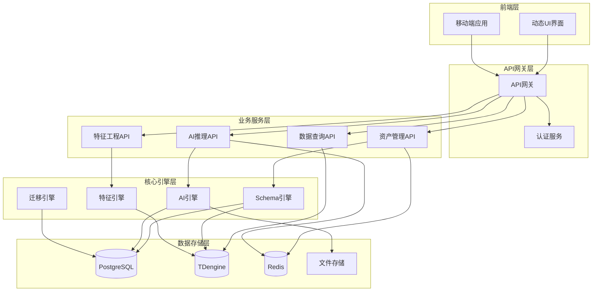
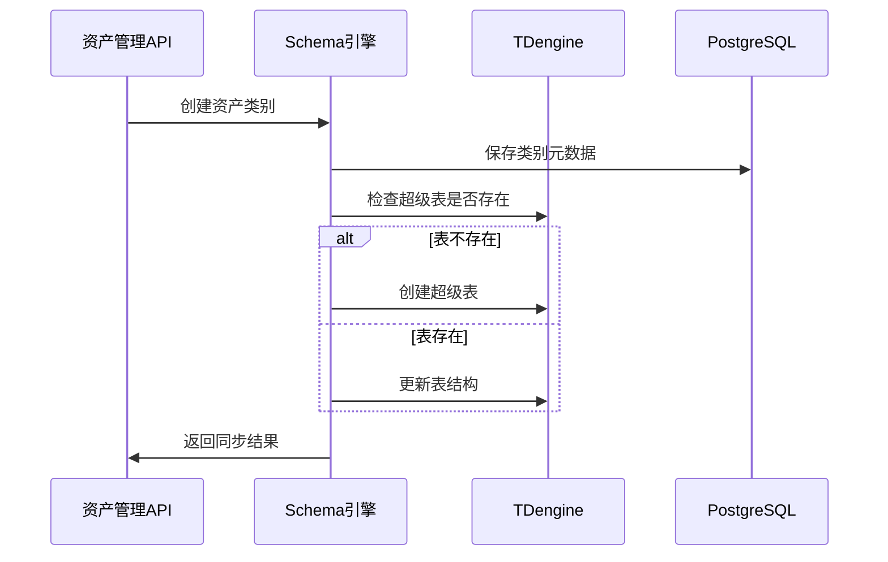
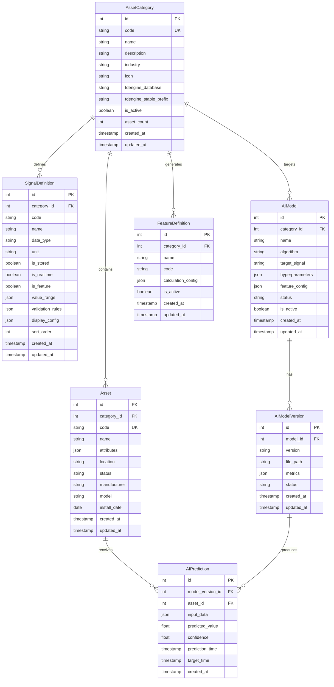
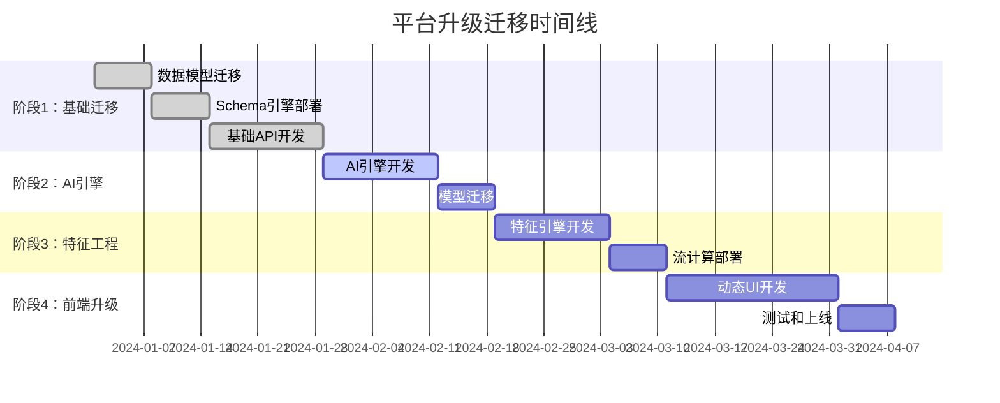
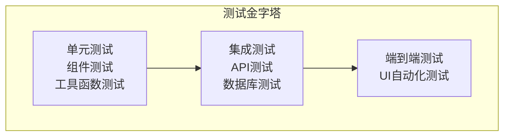

# 设计文档

## 概述

工业AI数据平台设计采用微服务架构，通过元数据驱动的方式实现对任意工业设备的统一管理。系统核心包括五大引擎：数据引擎、AI引擎、特征引擎、Schema引擎和API引擎，共同构建一个可扩展、高性能的工业数据平台。

## 架构设计

### 整体架构



### 核心组件设计

#### 1. Schema引擎

Schema引擎负责动态管理TDengine表结构，实现元数据驱动的数据模型。

**核心类设计：**

```python
class TDengineSchemaManager:
    """TDengine Schema动态管理器"""
    
    async def sync_category_schema(self, category_code: str) -> bool:
        """同步资产类别的Schema"""
        
    async def create_child_table(self, stable_name: str, asset_code: str, asset_id: int) -> bool:
        """为资产创建子表"""
        
    async def update_stable_structure(self, stable_name: str, signals: List) -> bool:
        """更新超级表结构"""
```

**Schema同步流程：**



#### 2. AI引擎

AI引擎提供统一的模型管理和推理服务，支持多种算法类型。

**核心架构：**

```python
class ModelRegistry:
    """AI模型注册中心"""
    
    async def register_model(self, model_data: Dict) -> int:
        """注册新模型"""
        
    async def deploy_model(self, model_id: int, version: str, file_path: str) -> bool:
        """部署模型版本"""
        
    async def activate_version(self, model_id: int, version: str) -> bool:
        """激活模型版本"""

class InferenceService:
    """统一推理服务"""
    
    async def predict(self, model_id: int, asset_id: int, input_data: Dict) -> Dict:
        """执行预测"""
        
    async def batch_predict(self, model_id: int, input_batch: List[Dict]) -> List[Dict]:
        """批量预测"""
```

**预测器抽象层：**

```python
class BasePredictor(ABC):
    """预测器基类"""
    
    @abstractmethod
    async def load_model(self) -> bool:
        """加载模型到内存"""
        
    @abstractmethod
    async def predict(self, input_data: Dict) -> Dict:
        """执行预测"""

class IsolationForestPredictor(BasePredictor):
    """孤立森林异常检测预测器"""
    
class ARIMAPredictor(BasePredictor):
    """ARIMA时间序列预测器"""
    
class XGBoostPredictor(BasePredictor):
    """XGBoost预测器"""
```

#### 3. 特征引擎

特征引擎通过JSON DSL配置自动生成TDengine流计算，实现特征工程自动化。

**DSL解析器：**

```python
class FeatureDSLParser:
    """特征定义DSL解析器"""
    
    @staticmethod
    def parse_feature_config(config: Dict) -> Dict:
        """解析特征配置"""
        
    @staticmethod
    def validate_function(function: str) -> bool:
        """验证聚合函数"""

class TDengineStreamGenerator:
    """TDengine流计算SQL生成器"""
    
    def generate_stream_sql(self, category_code: str, feature_configs: List[Dict]) -> str:
        """生成流计算SQL"""
        
    async def create_stream(self, stream_name: str, target_table: str, sql: str) -> bool:
        """创建流计算任务"""
```

**特征配置示例：**

```json
{
    "name": "avg_current_1h",
    "source_signal": "current",
    "function": "avg",
    "window": "1h",
    "slide_interval": "10m",
    "filters": {"status": "online"},
    "group_by": ["asset_id"]
}
```

## 数据模型设计

### 核心实体关系



### TDengine时序数据模型

**原始数据表结构：**

```sql
-- 超级表模板
CREATE STABLE raw_{category_code} (
    ts TIMESTAMP,
    {signal1} {type1},
    {signal2} {type2},
    ...
) TAGS (
    asset_id BIGINT,
    asset_code NCHAR(64)
);

-- 子表示例
CREATE TABLE raw_motor_MOTOR001 USING raw_motor TAGS (1, 'MOTOR001');
```

**特征数据表结构：**

```sql
-- 特征表模板
CREATE STABLE feat_{category_code}_{view_name} (
    ts TIMESTAMP,
    {feature1} DOUBLE,
    {feature2} DOUBLE,
    ...
) TAGS (
    asset_id BIGINT
);
```

## 接口设计

### RESTful API设计

#### 资产类别管理

```http
POST /api/v3/asset-categories
GET /api/v3/asset-categories
GET /api/v3/asset-categories/{id}
PUT /api/v3/asset-categories/{id}
DELETE /api/v3/asset-categories/{id}
GET /api/v3/asset-categories/{id}/signals
POST /api/v3/asset-categories/{id}/signals
```

#### 资产管理

```http
POST /api/v3/assets
GET /api/v3/assets
GET /api/v3/assets/{id}
PUT /api/v3/assets/{id}
DELETE /api/v3/assets/{id}
GET /api/v3/assets/{id}/realtime-data
GET /api/v3/assets/{id}/historical-data
```

#### AI推理

```http
POST /api/v3/predictions
GET /api/v3/assets/{id}/predictions
POST /api/v3/models
GET /api/v3/models
POST /api/v3/models/{id}/versions
PUT /api/v3/models/{id}/versions/{version}/activate
```

#### 特征工程

```http
POST /api/v3/feature-views
GET /api/v3/asset-categories/{code}/feature-views
GET /api/v3/feature-data/{category_code}/{view_name}
GET /api/v3/feature-views/{id}/quality
```

### 响应格式标准

```json
{
    "success": true,
    "message": "操作成功",
    "data": {
        // 具体数据
    },
    "timestamp": "2024-01-01T00:00:00Z",
    "request_id": "uuid"
}
```

## 迁移策略设计

### 分阶段迁移方案



### 双写策略

```python
class DualWriteAdapter:
    """双写适配器"""
    
    async def create_asset(self, asset_data: dict):
        """创建资产时同时写入新旧表"""
        # 1. 写入新表
        new_asset = await self._create_new_asset(asset_data)
        
        # 2. 写入旧表（兼容性）
        old_device = await self._create_old_device(asset_data)
        
        return new_asset
    
    async def sync_data_consistency(self):
        """定期同步数据一致性"""
        pass
```

## 错误处理设计

### 错误分类和处理策略

```python
class PlatformException(Exception):
    """平台基础异常"""
    
class SchemaException(PlatformException):
    """Schema相关异常"""
    
class AIEngineException(PlatformException):
    """AI引擎异常"""
    
class FeatureEngineException(PlatformException):
    """特征引擎异常"""

# 错误处理中间件
async def error_handler_middleware(request, call_next):
    try:
        response = await call_next(request)
        return response
    except SchemaException as e:
        return error_response(
            message=f"Schema错误: {str(e)}",
            error_code="SCHEMA_ERROR"
        )
    except AIEngineException as e:
        return error_response(
            message=f"AI引擎错误: {str(e)}",
            error_code="AI_ENGINE_ERROR"
        )
```

## 测试策略设计

### 测试金字塔



### 测试覆盖策略

1. **单元测试**：覆盖所有核心业务逻辑
2. **集成测试**：验证组件间交互
3. **性能测试**：验证系统性能指标
4. **安全测试**：验证访问控制和数据安全

## 正确性属性

*属性是一个特征或行为，应该在系统的所有有效执行中保持为真——本质上是关于系统应该做什么的正式陈述。属性作为人类可读规范和机器可验证正确性保证之间的桥梁。*

基于需求分析，以下是系统必须满足的核心正确性属性：

### 属性1：Schema自动生成一致性
*对于任何*有效的资产类别创建操作，创建后TDengine中应该存在对应名称的超级表，且表结构应该包含所有已定义的信号字段
**验证需求：需求1.1**

### 属性2：信号定义Schema同步
*对于任何*向资产类别添加信号定义的操作，操作完成后TDengine超级表应该包含新添加的信号字段
**验证需求：需求1.2**

### 属性3：资产子表自动创建
*对于任何*资产创建操作，创建成功后TDengine中应该存在以"超级表名_资产编码"命名的子表
**验证需求：需求1.3**

### 属性4：AI模型元数据完整性
*对于任何*AI模型注册操作，注册成功后数据库中应该包含完整的模型元数据，包括名称、算法类型、目标信号等必填字段
**验证需求：需求2.1**

### 属性5：模型版本部署验证
*对于任何*模型版本部署操作，如果模型文件有效，则部署应该成功并更新模型状态；如果文件无效，则应该失败并保持原状态
**验证需求：需求2.2**

### 属性6：模型激活推理可用性
*对于任何*成功激活的模型版本，该模型应该能够接收预测请求并返回有效结果
**验证需求：需求2.3**

### 属性7：预测结果持久化
*对于任何*成功的预测请求，预测结果应该被保存到数据库中，包含输入数据快照、预测值和时间戳
**验证需求：需求2.4**

### 属性8：特征DSL解析正确性
*对于任何*符合DSL规范的特征配置，解析器应该能够成功解析并返回标准化的配置对象
**验证需求：需求3.1**

### 属性9：流计算SQL生成有效性
*对于任何*有效的特征视图配置，生成的TDengine流计算SQL应该符合语法规范且能够成功执行
**验证需求：需求3.2**

### 属性10：数据迁移映射一致性
*对于任何*旧系统中的DeviceType记录，迁移后应该在新系统中存在对应的AssetCategory记录，且关键字段值保持一致
**验证需求：需求4.1**

### 属性11：双写数据一致性
*对于任何*在双写模式下的数据写入操作，新旧表中的对应记录应该包含一致的核心数据
**验证需求：需求4.2**

### 属性12：API响应格式标准化
*对于任何*API请求，响应应该包含success、message、data和timestamp字段，且数据格式符合OpenAPI规范
**验证需求：需求5.1**

### 属性13：数据存储延迟保证
*对于任何*资产数据接收操作，从接收到TDengine存储完成的时间应该小于1秒
**验证需求：需求6.1**

### 属性14：模型标识符唯一性
*对于任何*模型注册操作，分配的模型ID应该在系统中唯一，且元数据应该完整保存
**验证需求：需求7.1**

### 属性15：UI组件动态生成
*对于任何*资产类别定义，系统应该能够生成包含所有信号字段的表单组件
**验证需求：需求8.1**

### 属性16：负载下性能保证
*对于任何*在正常负载条件下的API调用，响应时间应该小于1秒
**验证需求：需求9.1**

### 属性17：JWT认证有效性
*对于任何*用户认证请求，如果凭据有效则应该返回有效的JWT令牌，如果无效则应该拒绝访问
**验证需求：需求10.1**

## 测试策略

### 双重测试方法

系统将采用单元测试和基于属性的测试相结合的方法：

- **单元测试**：验证特定示例、边界情况和错误条件
- **属性测试**：通过随机化输入验证通用属性
- 两者互补，提供全面覆盖（单元测试捕获具体错误，属性测试验证通用正确性）

### 基于属性的测试配置

- **最小迭代次数**：每个属性测试运行100次迭代（由于随机化）
- **测试标记格式**：**功能：industrial-ai-platform-upgrade，属性{编号}：{属性文本}**
- **测试框架**：使用Python的Hypothesis库进行属性测试
- 每个正确性属性必须由单个基于属性的测试实现

### 单元测试平衡

- 单元测试有助于特定示例和边界情况
- 避免编写过多单元测试 - 基于属性的测试处理大量输入覆盖
- 单元测试应专注于：
  - 演示正确行为的特定示例
  - 组件间集成点
  - 边界情况和错误条件
- 属性测试应专注于：
  - 适用于所有输入的通用属性
  - 通过随机化实现全面输入覆盖