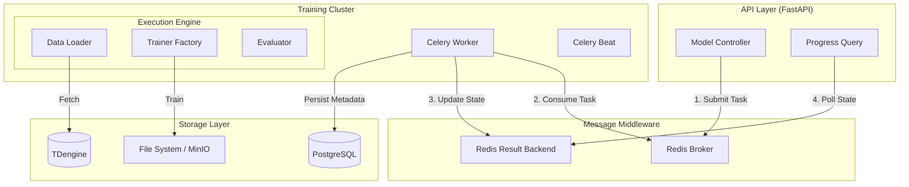
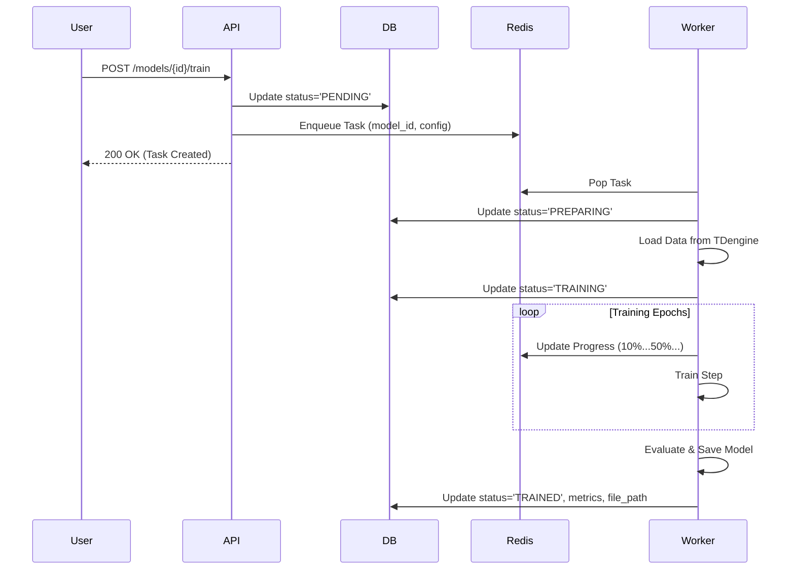
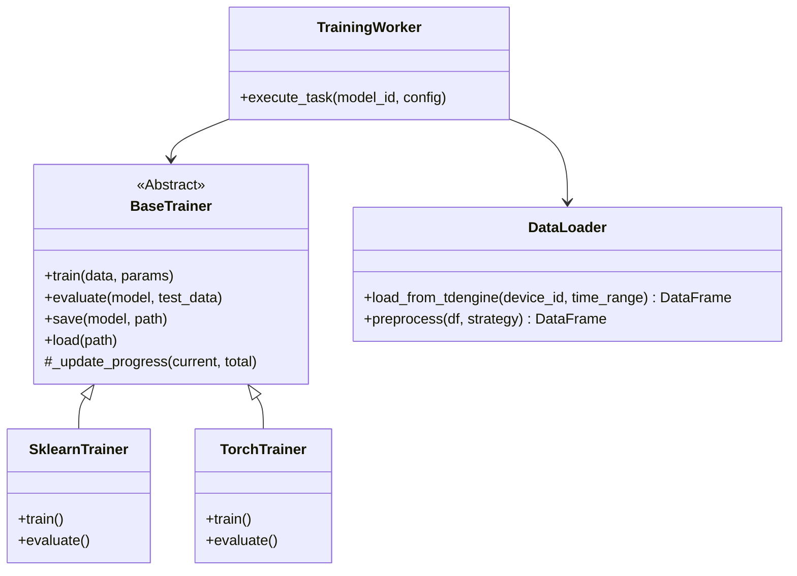

# 独立 AI 训练系统详细设计文档

> **版本**: 1.1  
> **状态**: 详细设计  
> **更新时间**: 2025-12-11  

---

## 1. 设计目标

构建一个独立、可扩展、高性能的 AI 模型训练子系统，实现以下目标：
1.  **独立性**：训练任务在独立进程（Celery Worker）中运行，计算密集型任务不阻塞 API 主进程。
2.  **可观测性**：全链路监控，提供毫秒级的训练进度反馈、实时日志流、资源消耗（CPU/GPU/Mem）监控。
3.  **兼容性**：设计统一的 `BaseTrainer` 抽象层，无缝适配 Scikit-learn, PyTorch, TensorFlow 等框架。
4.  **数据隔离**：训练数据通过标准 Data Loader 接口从时序数据库（TDengine）提取，与业务数据库解耦。

---

## 2. 系统架构

### 2.1 逻辑架构图



### 2.2 核心时序图 (任务提交流程)



---

## 3. 数据架构详细设计

### 3.1 数据库 Schema 设计 (PostgreSQL)

基于现有的 `t_ai_models` 表进行扩展，支持更细粒度的任务追踪。

```sql
-- 修改现有表结构
ALTER TABLE "t_ai_models" 
    ADD COLUMN "progress" DOUBLE PRECISION DEFAULT 0.0,      -- 训练进度 (0.0-100.0)
    ADD COLUMN "task_id" VARCHAR(64),                        -- Celery Task ID
    ADD COLUMN "error_log" TEXT,                             -- 详细错误堆栈
    ADD COLUMN "started_at" TIMESTAMP WITH TIME ZONE,        -- 实际开始时间
    ADD COLUMN "finished_at" TIMESTAMP WITH TIME ZONE,       -- 实际结束时间
    ADD COLUMN "resource_usage" JSONB DEFAULT '{}';          -- 资源消耗快照

-- resource_usage 示例结构:
-- {
--     "cpu_percent": 45.2,
--     "memory_mb": 1024,
--     "gpu_util": 0,
--     "duration_seconds": 120
-- }
```

### 3.2 Redis 数据结构设计

用于实时状态存储和日志流，避免高频写入数据库。

| Key Pattern | Type | TTL | Description |
| :--- | :--- | :--- | :--- |
| `celery-task-meta-{task_id}` | Hash | 24h | Celery 原生任务状态，包含 result, status |
| `ai:training:logs:{model_id}` | List | 1h | 实时训练日志（定长队列，保留最近 1000 条） |
| `ai:training:lock:{model_id}` | String | 1h | 分布式锁，防止同一模型重复提交训练 |

---

## 4. API 接口详细设计

### 4.1 提交训练任务

*   **Endpoint**: `POST /api/v2/ai/models/{model_id}/train`
*   **Request Body**:
    ```json
    {
      "training_dataset": "...", // 数据集配置 JSON
      "training_parameters": {   // 算法超参数
        "epochs": 100,
        "batch_size": 32,
        "learning_rate": 0.001
      }
    }
    ```
*   **Response**:
    ```json
    {
      "code": 200,
      "data": {
        "task_id": "c8495a62-...",
        "status": "PENDING"
      }
    }
    ```

### 4.2 获取实时日志 (WebSocket/HTTP Stream)

*   **Endpoint**: `GET /api/v2/ai/models/{model_id}/logs/stream`
*   **Protocol**: Server-Sent Events (SSE) 或 WebSocket
*   **Response Format**:
    ```text
    data: {"timestamp": "...", "level": "INFO", "message": "Epoch 1/100, Loss: 0.523"}
    data: {"timestamp": "...", "level": "INFO", "message": "Epoch 2/100, Loss: 0.412"}
    ```

---

## 5. 核心模块详细设计 (Python)

### 5.1 类图设计



### 5.2 抽象基类定义 (`app/services/ai/trainer.py`)

```python
from abc import ABC, abstractmethod
from typing import Any, Dict, Callable

class BaseTrainer(ABC):
    def __init__(self, model_id: int, progress_callback: Callable[[float], None] = None):
        self.model_id = model_id
        self.progress_callback = progress_callback

    @abstractmethod
    def train(self, data: Any, params: Dict[str, Any]) -> Any:
        """执行训练，返回训练好的模型对象"""
        pass

    @abstractmethod
    def evaluate(self, model: Any, test_data: Any) -> Dict[str, float]:
        """评估模型，返回指标字典"""
        pass
        
    def update_progress(self, current_step: int, total_steps: int):
        if self.progress_callback and total_steps > 0:
            progress = (current_step / total_steps) * 100
            self.progress_callback(round(progress, 2))
```

### 5.3 数据加载器 (`app/services/ai/data_loader.py`)

```python
import pandas as pd
from app.core.tdengine import td_client

class TDengineLoader:
    async def load(self, device_id: str, start_time: str, end_time: str) -> pd.DataFrame:
        sql = f"""
            SELECT ts, value 
            FROM device_data 
            WHERE device_id = '{device_id}' 
            AND ts >= '{start_time}' AND ts <= '{end_time}'
        """
        data = await td_client.query(sql)
        return pd.DataFrame(data)
```

---

## 6. 前端集成详细设计

### 6.1 状态机流转

前端根据 `status` 字段展示不同的 UI 状态：

*   **DRAFT (草稿)**: 显示 "开始训练" 按钮。
*   **PENDING (排队中)**: 按钮禁用，显示 "排队中..."，显示 Loading 图标。
*   **PREPARING (准备数据)**: 显示进度条 (0-5%)，提示 "正在加载数据..."。
*   **TRAINING (训练中)**: 显示进度条 (5-99%)，实时刷新进度，显示 "停止训练" 按钮。
*   **TRAINED (已完成)**: 进度条 100% (绿色)，显示 "查看报告" 和 "重新训练" 按钮。
*   **ERROR (失败)**: 进度条红色，显示错误日志摘要，提供 "重试" 按钮。

### 6.2 轮询策略

为减少服务器压力，采用自适应轮询策略：

1.  **初始阶段**: 每 2 秒轮询一次 `GET /models/{id}`。
2.  **稳定训练阶段**: 如果进度在 1 分钟内变化小于 1%，降级为每 5 秒轮询一次。
3.  **完成/失败**: 停止轮询。

---

## 7. 异常处理与容错设计

1.  **任务超时**:
    *   Celery 配置 `time_limit=3600` (1小时硬超时)，防止僵尸任务占用 Worker。
2.  **Worker 崩溃**:
    *   Redis 启用 AOF 持久化，任务队列不丢失。
    *   Celery 配置 `acks_late=True`，任务只有在执行成功后才确认，崩溃后可由其他 Worker 重试。
3.  **资源不足**:
    *   Worker 节点配置 OOM Killer 保护。
    *   每个 Worker 限制并发数为 CPU 核数，防止内存溢出。
4.  **数据库连接失败**:
    *   实现指数退避重试 (Exponential Backoff)，重试 3 次后标记任务失败。

---

## 8. 实施计划 (Timeline)

| 阶段 | 任务 | 预计工时 | 产出物 |
| :--- | :--- | :--- | :--- |
| **P1** | 引入 Celery & Redis 基础架构 | 2 天 | `celery_app.py`, Docker Compose update |
| **P2** | 实现 BaseTrainer & TDengineLoader | 3 天 | 核心 Python 模块 |
| **P3** | 迁移现有模拟逻辑到 Worker | 1 天 | 验证异步流程跑通 |
| **P4** | 集成 Scikit-learn 真实算法 | 3 天 | `SklearnTrainer` 实现 |
| **P5** | 前端状态机与进度条对接 | 2 天 | Vue 组件更新 |
| **P6** | 压力测试与调优 | 2 天 | 性能测试报告 |

---

## 9. 配置参考 (Celery)

```python
# app/core/celery_config.py

broker_url = 'redis://localhost:6379/0'
result_backend = 'redis://localhost:6379/1'
task_serializer = 'json'
result_serializer = 'json'
accept_content = ['json']
timezone = 'Asia/Shanghai'
enable_utc = True

# 任务路由
task_routes = {
    'app.tasks.ai.train_model': {'queue': 'ai_training'},
    'app.tasks.ai.evaluate_model': {'queue': 'ai_evaluation'},
}

# 任务限流
task_annotations = {
    'app.tasks.ai.train_model': {'rate_limit': '10/m'}
}
```